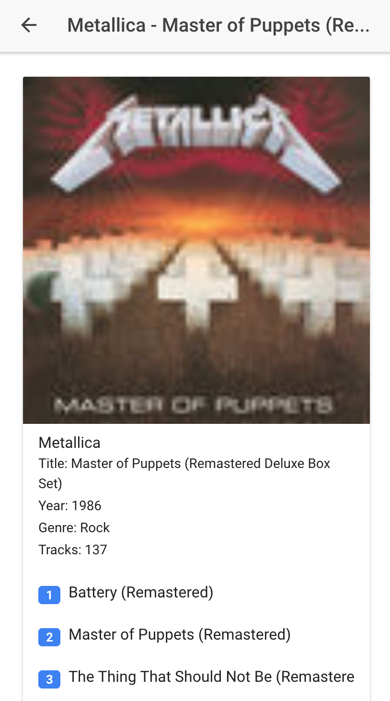

# Music Search

This is a small mobile app based on ionic that allows you to search for your favorite artist and 

**Note - Ionic is not very friendly when it comes to unit testing.  The intent here it to add some tests.  This project is already setup for testing but no tests have been created yet.

Prerequisites
-----------

Ionic is a needed to run this project.

```
$ npm install -g ionic
```

If you run `ionic -v` it should return `3.0.0`.


Getting Started with this Project
-----------

To get started, clone this repo, and run `npm install` in the root directory.

```sh
$ git clone https://github.com/davidjamesherzog/music-search-ionic.git
$ cd music-search-ionic
$ npm install
```

Running the app
-----------

```sh
$ ionic serve
```

What does the app look like?
-----------



### Unit Tests

To run the tests, run `npm run test`.

See the example test in `src/app/app.component.spec.ts` for an example of a component test.

### End-To-End Tests (Browser-Only)

To serve the app, run `ionic serve`.

To run the end-to-end tests, run (while the app is being served) `npm run e2e`.

See the example end-to-end test in `e2e/app.e2e-spec.ts`.


